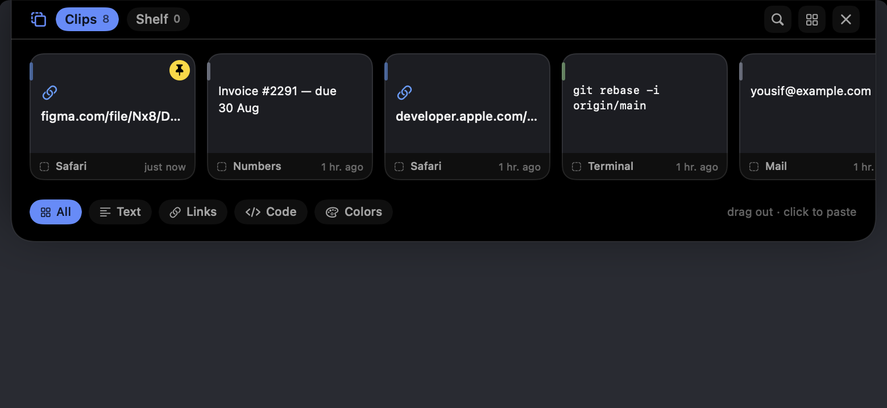
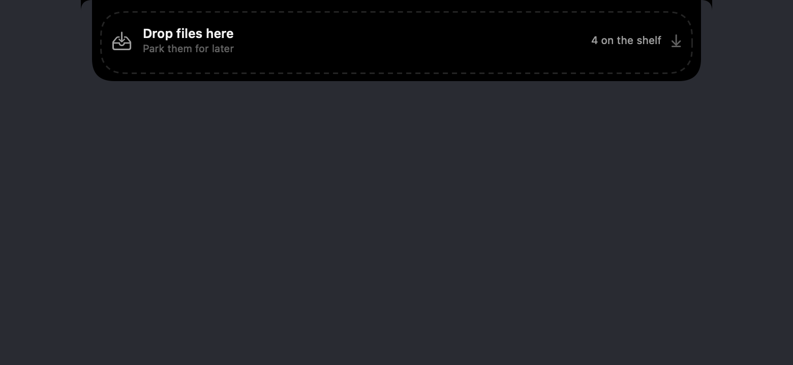
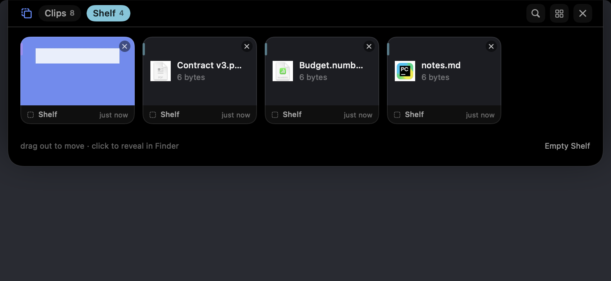
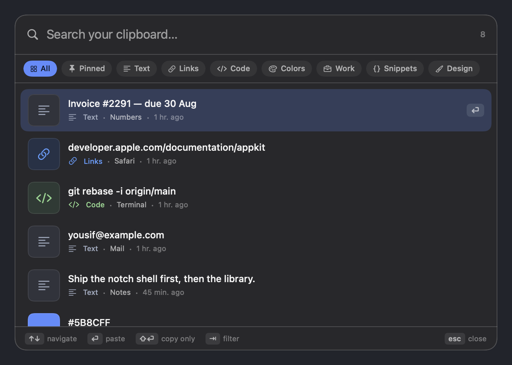
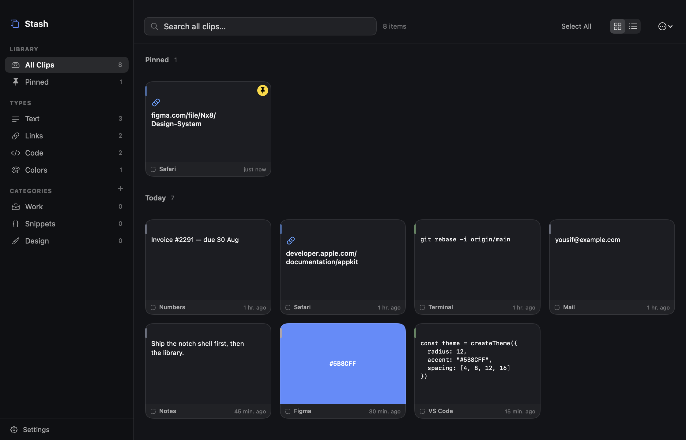
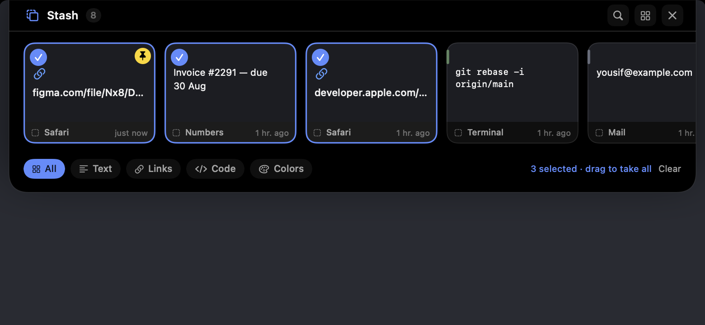

# Stash

A clipboard and screenshot memory for macOS that lives in the notch.

Everything you copy is kept in a visual history that groups itself by type, by the
app it came from, and by categories you define. Get it back from the notch, from a
Spotlight-style search, or from a full library window — and paste it straight into
whatever you were working in.



[](https://github.com/yousifnawar/Stashh/actions/workflows/ci.yml)


---

## Install

Grab the latest `.dmg` from [**Releases**](https://github.com/yousifnawar/Stashh/releases/latest),
open it, and drag Stash to Applications. The build is universal — Apple Silicon and Intel.

> **First launch is blocked, and that's expected.** The app isn't notarised by Apple
> (that needs a paid Developer account), so macOS refuses it the first time. Open
> **System Settings → Privacy & Security**, scroll down, and click **Open Anyway**.
> You only do this once.

Or build it yourself, which sidesteps that entirely:

```bash
git clone https://github.com/yousifnawar/Stashh.git
cd Stashh
./Scripts/run.sh
```

Requires macOS 14+ and the Xcode command line tools.

---

## What it does

**Captures on its own**

- Every clipboard change: text, rich text, links, code, colours, images, files.
- Every new screenshot, read straight from your screenshot folder — including ones
  you never copied.
- Remembers which app each clip came from, and skips password managers entirely.

**Sorts itself**

- Detects links, code, hex/rgb colours, files, images, screenshots and rich text.
- Groups by source app, by day, and by categories you make — with optional keyword
  rules that file new clips automatically.
- Pinning, free-form tags, and a retention window you choose.

**Holds files while you move them**

Start dragging a file and take it toward the top of the screen — a drop target slides
out of the notch. Let go and the file waits on the Shelf until you drag it wherever
it was going. Useful when the destination folder isn't open yet, or the file is in
one window and the target is in another.





Stash hard-links or copies each file into its own storage, so the shelf keeps working
even if you move or delete the original. Parked files stay out of the clipboard
history — the shelf is a staging area, not an archive.

**Four ways back in**

| Surface | Default shortcut | What it's for |
|---|---|---|
| Notch shell | hover the notch, or `⌘P` | Recent clips as a strip. Click to paste, drag into any app. |
| Quick search | `⌘⇧V` | Type a few characters, `⏎` pastes into the app you came from. |
| Library | `⌘⇧C` | Everything, with sidebar filters, grid/list views and an inspector. |
| Menu bar | click the icon | Last 12 clips, pause capture, tutorial, settings. |

Every shortcut is rebindable in Settings → Shortcuts. The recorder refuses a
combination another Stash action already uses, refuses bare keys that would type
instead of trigger, and warns you when a choice shadows a common system shortcut
(the stock `⌘P` shadows Print, for instance).

| Quick search | Library |
|---|---|
|  |  |

**Several at once**

Hover any clip — in the notch or the library — and a selection circle appears in its
corner. Tick as many as you like, then drag any one of them to take the whole set
into another app. This works for shelf files too, so you can park a pile and move
them together.



---

## Permissions

| Permission | Why | Without it |
|---|---|---|
| Accessibility | Lets Stash press `⌘V` in the app you were using | Clips are copied to your clipboard; you paste them yourself |
| Screenshot folder | Watching for new screenshots | Screenshots are only captured if you copy them |

Both are optional. Stash asks once and never nags.

## Your data

Everything lives in `~/Library/Application Support/Stash/`:

```
stash.sqlite    the index (SQLite, WAL mode)
Blobs/          full-size images and RTF payloads
Thumbnails/     generated previews
```

**There is no network code in this app.** Nothing is uploaded, and there is no
telemetry. Unpinned clips are pruned on the schedule you pick in Settings (30 days
by default); pinned clips are never pruned. Clips from password managers, and
anything marked concealed on the pasteboard, are never recorded at all.

---

## Building

```bash
./Scripts/run.sh                  # build and launch
./Scripts/build.sh release        # build build/Stash.app
UNIVERSAL=1 ./Scripts/package.sh  # universal .app plus a .dmg
```

### Verifying without a mouse

Two dev entry points make the parts that normally need a human testable:

```bash
.build/debug/Stash --selftest            # 30 checks, exits non-zero on failure
.build/debug/Stash --render-preview docs # renders every screen to PNG, offscreen
```

`--selftest` covers the drag-and-drop plumbing (multi-file drops, ordering, images
dragged from a browser with no file behind them, pasteboard writers), the file shelf
(staging, surviving a deleted original, de-duplication, promotion to history) and the
shortcut system (rebinding rules, modifier ordering, Carbon translation, conflict detection,
persistence of cleared bindings). `--render-preview` renders the notch, library,
search, settings and every tutorial page through real offscreen windows, so layout
regressions show up without launching anything. Both redirect their storage to a
temp directory and never touch a real library.

CI runs the build and the self test on every push.

### Shipping a release

Tag it and the workflow does the rest — universal build, DMG, GitHub release:

```bash
git tag v1.0.0 && git push --tags
```

To ship a *notarised* build (no Gatekeeper warning for users), you need a paid Apple
Developer account, then:

```bash
DEVELOPER_ID="Developer ID Application: Your Name (TEAMID)" \
NOTARY_PROFILE=stash-notary \
./Scripts/package.sh
```

---

## How it's put together

```
Sources/Stash/
  App/         lifecycle, hot keys, shortcut registry, menu bar, settings, dev harnesses
  Model/       ClipItem, Category, fuzzy scoring, shared helpers
  Store/       SQLite wrapper, ClipStore and the file shelf
  Capture/     clipboard polling, screenshot watching, type classification, blobs
  Paste/       pasteboard writing, ⌘V synthesis, drag providers, drop ingestion
  UI/          notch shell, quick search, library, inspector, tutorial, theme
```

Roughly 5,500 lines of Swift, no third-party dependencies.

### Problems worth noting

**The notch panel can't use SwiftUI's hover.** It's a non-activating panel, so it
never steals focus from the app you're typing in — which also means AppKit tracking
areas never fire and `.onHover` is dead. Pointer position is tracked with a global
mouse monitor and pushed down the view tree through the environment, and views
compare it against their own frame in a named coordinate space.

**The window is always full size, but shouldn't swallow your desktop.** A `GateView`
overrides `hitTest` to reject anything outside the shell's currently visible bounds,
so the rest of the window is transparent to clicks. When hover-to-open is switched
off, that region shrinks to nothing.

**SwiftUI can't drag more than one item.** `.onDrag` vends exactly one item provider.
Dragging a multi-selection drops to AppKit and starts a real `NSDraggingSession` with
one dragging item per clip — but only on tiles that are part of a selection, so the
single-clip path stays pure SwiftUI.

**macOS won't tell you a drag has started.** There is no notification for it, so the
shelf watches the drag pasteboard's change count alongside the mouse button state —
the change count ticks the instant any drag begins anywhere on the system. The drop
target only appears once that drag reaches the top strip of the screen, so it stays
out of the way the rest of the time.

**Key names have to come from the keyboard layout.** The shortcut recorder resolves
key codes through `UCKeyTranslate` against the active input source rather than
assuming US QWERTY, so a recorded shortcut displays correctly on any layout.

**Search is ranked, not filtered.** The 4,000 most recent clips stay in memory and
are scored with a fuzzy subsequence matcher that rewards consecutive runs, word
starts and prefix hits, then tilts the result by pins, use count and recency.

---

## Licence

MIT — see [LICENSE](LICENSE). Use it, fork it, ship it.
